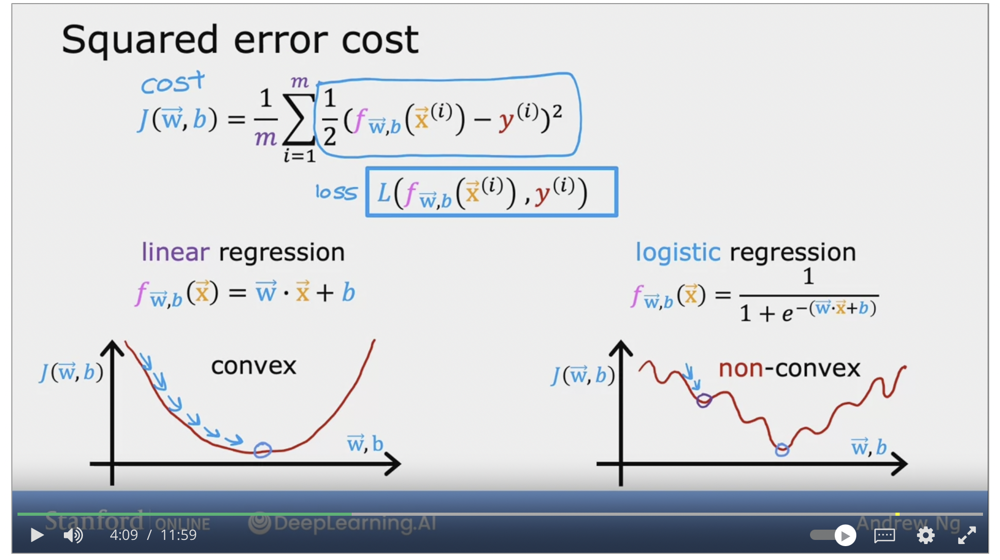

# Gradient Descent

To find the min of the value for w and b, we can use gradient decent to systematically find the min value. This doesn't just apply to linear regression cost function.

To find the minimum J(w,b) we can start out as w and b ot be zero, Increment the value of w and b to find the min J(w,b).

$$
W = w - \alpha {\frac d {dw}} J(w,b)
$$

* W - new w value
* w - old w value
* Alpha - learning rate (small positive number between 0-1)
* using the old w value and updating it to a small amount which is on the right expression&#x20;

$$
{\frac d {dw}} J(w,b)
$$

* This is the derivitive term for cost function J. Describe where the gradient descent wants to take the baby step.&#x20;
* With the alpha describe how big of a step to towards the direction.

$$
B = b - \alpha {\frac d {db}} J(w,b)
$$

To find the valley in the graph using gradient descent, repeat the calculation until the 2 points (w,b) converge. during the gradient descent process, it will need to simulataneously update w and b to a new value. **(Correct way)**

<figure><figcaption></figcaption></figure>

$$
\
$$

### Gradient Descent Intuition

Look into the derivative of the function of J which is the equation in the box:

$$
W = w - \alpha \boxed{{\frac d {dw}} j(w)}
$$

Is to draw a tangent line, which is a straight line that touches the curve at that point. The **Slope** of this line is the derivative of the **function J** at this point.&#x20;

To get the slope of the tangent, you can draw a line straight down and across to find the slope using pythagorus.&#x20;

<figure><figcaption></figcaption></figure>

* When the tangent is pointing up and to the right, this means that the derivative is positive, so is greater than 0.

$$
W = w -\alpha(positiveNumber)
$$

This will give you a smaller number which in turn move the point to the left towards the lower value of w.

* When the Line is pointing up on the left this means that is has a negative slope.&#x20;

$$
W = w - \alpha(negativeNumber)
$$

This will end up increating the number of the value of w, this will get you closer to the min of of J(w)

### Learning Rate

<figure><figcaption></figcaption></figure>

* Learning is too small, this will take baby steps to get to w. The outcome of the of the J(w), need alot of step to get to minimum.
* Learning rate is too large, this it will missed the minimum of w and move passed to w. It will progressively getting worst result

when gradient decent already reach local minimum. When the cost function have more than 1 local minimum.

<figure><figcaption></figcaption></figure>

When drawing a tangent line at the local minimum the slop will be 0, and therefore the gradient decent becomes:

$$
W = w - \alpha (0)
$$

This means that W = w, the old w is the same as the new W.  Then the gradient will do nothing. As the gradient descent getting closer and closer to the local minimum, each time it is taking smaller and smaller steps **eventhough the learning rate is kept at a fix value.**

## [Gradient descent for Linear Regression](https://www.coursera.org/learn/machine-learning/lecture/lgSMj/gradient-descent-for-linear-regression)

> _Using Gradient descent to minimize the cost function J(w,b) this in turns reduce the value w, b._&#x20;

The derivative of the w looks like this:&#x20;

$$
W = w - \alpha \boxed { {\frac d {dw}} J(w,b)} -> {\frac 1 m} \sum_{i=1}^m(f_{w,b}(x^{(i)}) -y^{(i)})x^{(i)}
$$

$$
W = b - \alpha \boxed { {\frac d {db}} J(w,b)} -> {\frac 1 m} \sum_{i=1}^m(f_{w,b}(x^{(i)}) -y^{(i)})
$$

There are more than 1 local mininum but there can be only 1 global minimum.

> _But turns out that using the squared error cost function there can be only be 1 single global minimum and there cannot have a local minimum. This is called a convex function._

<figure><figcaption></figcaption></figure>

### [Batch Gradient Descent](https://www.coursera.org/learn/machine-learning/lecture/349Ay/running-gradient-descent)

* refers to the fact that on every step of the gradient descent, we're looking at all of the training examples, instead of just a subset of the training data. It uses all the training data.&#x20;

There are other gradient descent that doesnt look into the entire set of the training data.&#x20;
